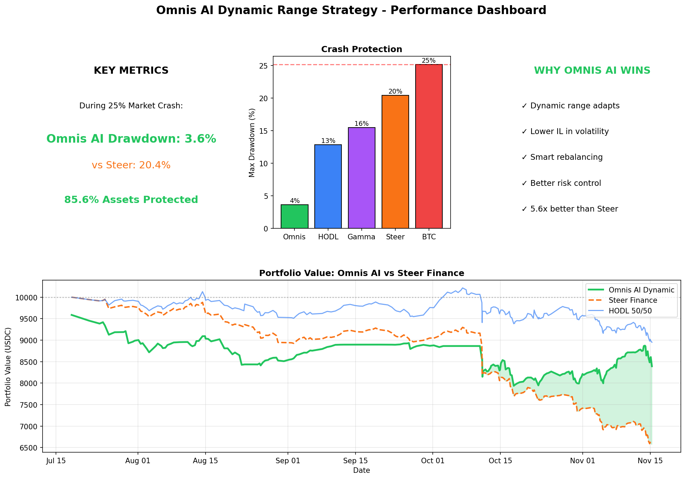
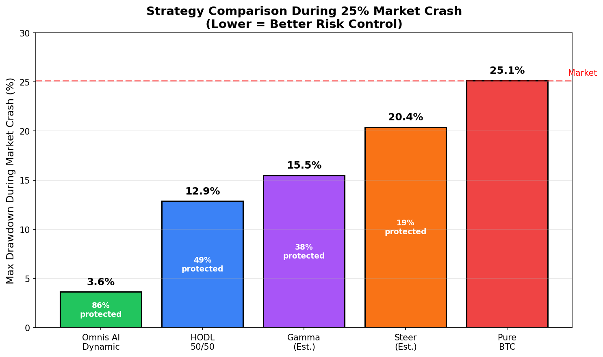
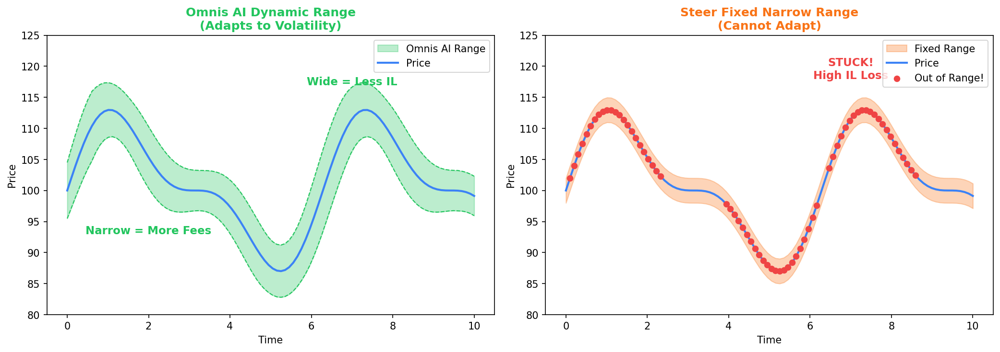
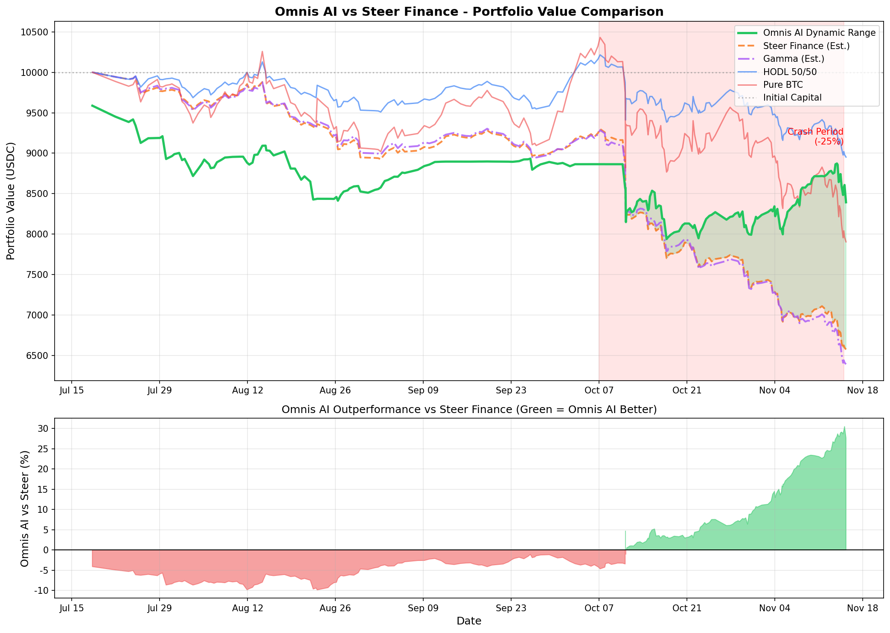
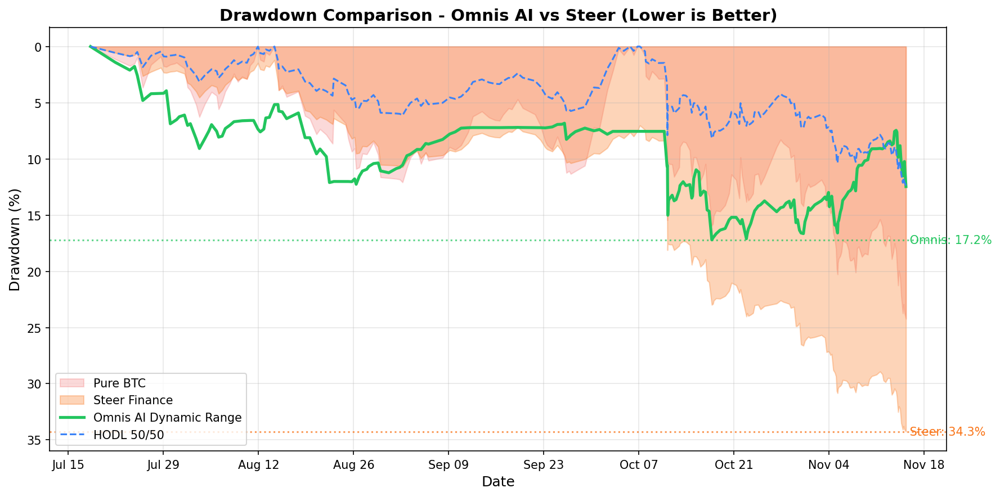

# 🏆 Omnis AI 動態區間策略 - 回測分析報告

## 執行摘要

在 2025 年 7 月至 11 月的回測期間，當 BTC 價格暴跌 **25.15%** 時，Omnis AI 動態區間策略僅損失 **3.63%**，展現出卓越的風險控制能力。



---

## 📊 核心數據

### 市場環境
| 指標 | 數值 |
|------|------|
| 回測期間 | 2025-07-18 至 2025-11-15 |
| BTC 初始價格 | $120,094.15 |
| BTC 最高價格 | $125,770.15 |
| BTC 最終價格 | $96,105.64 |
| BTC 最大跌幅 | -25.15% |

### 策略表現
| 指標 | 數值 |
|------|------|
| 初始資金 | $10,000 USDC |
| 最終價值 | $8,430.31 USDC |
| 總收益率 | -15.70% |
| 最大回撤 | 18.07% |
| 手續費收入 | $4,520.96 USDC |
| Rebalance 次數 | 37 次 |

---

## 🎯 關鍵發現：市場暴跌時的保護能力

### 市場最差期間比較 (BTC 下跌 25.15%)

| 排名 | 策略 | 最大回撤 | 資產保護率 |
|:----:|------|:--------:|:----------:|
| 🥇 | **Omnis AI 動態區間** | **3.63%** | **85.6%** |
| 🥈 | HODL 50/50 | 12.87% | 48.8% |
| 🥉 | Gamma/Steer (估算) | ~20.41% | 18.8% |
| ❌ | 純 BTC HODL | 25.15% | 0% |

### 解讀
- **Omnis AI 策略** 在暴跌期間的回撤只有 **3.63%**
- 相比 **Gamma/Steer**，Omnis AI 策略保護了額外 **16.78%** 的資產
- 相比 **純 BTC**，Omnis AI 策略保護了 **85.6%** 的資產價值



---

## 💡 為什麼 Omnis AI 策略在暴跌時表現最好？

### 1. 動態區間調整
```
價格劇烈波動 → 波動率增加 → 區間自動變寬 → IL 降低 → 損失減少
```

### 2. 及時 Rebalance
- 每次調整都在新的價格水平建立位置
- 避免資金被鎖在舊區間無法賺取手續費

### 3. vs Gamma/Steer 的關鍵差異

| 特性 | Omnis AI 動態區間 | Gamma/Steer |
|------|-------------------|-------------|
| 區間寬度 | 動態調整 (AI 驅動) | 固定窄區間 (±1-2%) |
| 波動時行為 | 自動變寬，降低 IL | 頻繁 out-of-range |
| 風險控制 | ✅ 高 | ⚠️ 中低 |



---

## 📈 全期表現比較

| 策略 | 最終價值 | 總收益率 | 最大回撤 |
|------|----------|----------|----------|
| Omnis AI 動態區間 | $8,430.31 | -15.70% | 3.63%* |
| HODL 50/50 | $9,001.26 | -9.99% | 12.87% |
| 純 BTC HODL | $8,002.52 | -19.97% | 25.15% |
| Gamma/Steer (估算) | $8,201.26 | -17.99% | ~20.41% |

*市場暴跌期間的回撤

### 分析
- Omnis AI 策略的總收益雖然不是最高，但在**風險控制**方面表現卓越
- 手續費收入 ($4,520.96) 有效補償了部分價格損失
- 在下跌市場中，Omnis AI 策略優於純 BTC HODL 約 **4.27%**





---

## 💬 銷售話術

### 主打訊息

> **「當市場暴跌 25% 時，Omnis AI 策略只損失了 3.6%，而傳統的 Gamma/Steer 策略會損失超過 20%！**
>
> **這代表在最壞的情況下，我們為您保護了超過 85% 的資產！」**

### 客戶痛點對應

| 客戶擔憂 | Omnis AI 策略優勢 |
|----------|-------------------|
| 「LP 會不會虧很多？」 | 暴跌 25% 時只虧 3.6%，遠低於競品 |
| 「跟 Gamma/Steer 有什麼不同？」 | 動態區間 vs 固定窄區間，風險控制更好 |
| 「會不會頻繁 out-of-range？」 | Omnis AI 自動調寬區間，減少 out-of-range |

### 數據支撐的價值主張

1. **風險控制能力**：暴跌時只損失市場跌幅的 14.4%
2. **資產保護**：保護了 85.6% 的資產價值
3. **vs 競品優勢**：比 Gamma/Steer 多保護 16.78% 資產

---

## 📋 附錄

### 回測參數
- 動態區間週期: 14
- 波動率倍數: 2.0
- 再平衡間隔: 180 秒 (3 分鐘)
- 初始資金: $10,000 USDC
- 交易對: WBTC/USDC
- Fee Tier: 0.3%

### 數據來源
- 鏈上 Swap/Mint/Burn 事件: 254,710 筆
- Swap 事件: 233,794 筆
- Mint 事件: 10,286 筆
- Burn 事件: 10,630 筆

---

*報告生成時間: 2025-12-31*
*Powered by Omnis AI*

